# Artemis Customer Scenario

This project orchestrates a messaging system using the Artemis Broker, enabling message exchange between a sender and a receiver across three separate Kubernetes namespaces. Leveraging the Artemis Broker Operator and Skupper.io, it facilitates seamless message flow in a distributed environment, demonstrating a robust customer scenario with Ansible automation at its core.

## Overview

The Artemis Customer Scenario is designed to showcase a realistic use case of message exchange within a distributed system. The architecture consists of three main components:

- **Sender Site**: Initiates the message sending process.
- **Broker Site**: Acts as the middleware, handling message queuing and delivery.
- **Receiver Site**: Receives and processes messages sent by the Sender Site.

These components are interconnected using [Skupper.io](https://skupper.io/) for secure, site-to-site communication across Kubernetes namespaces or clusters, highlighting the potential for cross-cloud messaging solutions.

## Architecture Diagram



## Prerequisites

Before you begin, ensure you have the following prerequisites met:

- A running Kubernetes cluster (Minikube or any cloud-based Kubernetes service).
- `ansible` and `kubectl` installed on your local machine.
- Proper access permissions to manage resources within your Kubernetes cluster.

## Getting Started

To deploy the Artemis Customer Scenario, follow these steps:

1. **Install Required Ansible Collections**:

    Use the command below to install necessary Ansible Galaxy collections from the `requirements.yml` file:

    ```shell
    ansible-galaxy collection install -r requirements.yml
    ```

2. **Deploy with Ansible**:

    Launch the deployment by running the main Ansible playbook. This command sets up the Kubernetes namespaces, deploys the Artemis Broker, and establishes Skupper.io links:

    ```shell
    ansible-playbook main.yml
    ```

## Technology Stack

This project employs a diverse set of technologies, including:

- **Kubernetes**: For hosting the messaging components in a scalable and manageable manner.
- **Artemis Broker**: A versatile messaging broker that supports a wide array of protocols and offers high performance.
- **Skupper.io**: Facilitates secure, scalable site-to-site communication in Kubernetes environments.
- **Ansible**: Automates the provisioning and configuration of the messaging infrastructure.

## Project Structure

- `ansible.cfg`: Configuration settings for Ansible.
- `inventory.yml`: Defines the hosts and their roles within the Ansible automation.
- `kubernetes_manifests/`: Kubernetes manifests for setting up the sender and receiver components.
- `main.yml`: The main Ansible playbook for orchestrating the environment setup.
- `requirements.yml`: Specifies the Ansible collections needed for the project.
- `roles/`: Contains Ansible roles for each project component, including Kubernetes setup, Artemis operator configuration, and more.


## Skupper Configuration

Both sites, the sender and receiver, are connected to the broker site using Skupper. The Skupper configuration is defined in the `roles/skupper` role, which sets up the necessary connections between the sites. The service created by the broker deployment is exposed to the sender and receiver sites, allowing them to communicate securely using Skupper. Please check the inventory.yml files for details, since we are using Skupper Ansible to deploy the environment.
## Running the Project

Ensure your Kubernetes cluster is up and running before starting. Install the required Ansible collections and execute the main playbook to deploy the Artemis Customer Scenario.

## Contributing

We welcome contributions to improve the Artemis Customer Scenario. Please see the contributing guidelines for more details.

